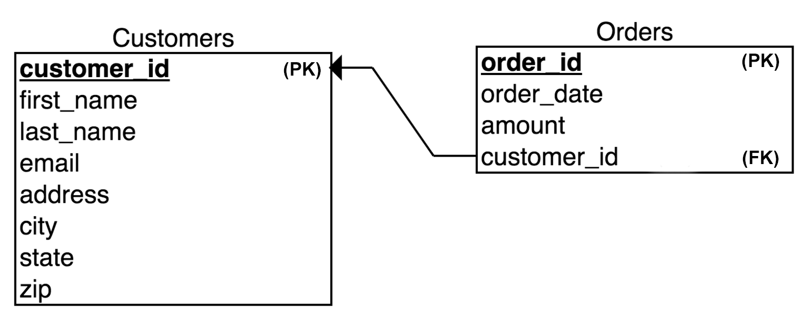

## Week 2.4 SQL

## Joins

RECAP from [Monday](sql_day1.md): 

**Relational Model**

**Orders** table contains two keys: one for **order** and one for **customer** who placed the order. 

The key that refers to the entity described in that table is the **primary** key (*customer_id*), the other key is called a **foreign key** (*customer_id*).

The `PRIMARY` and `FOREIGN` key are essential to describing relations between the tables, and in performing SQL `JOINS`


**Join Example:**

To find all orders placed by a particular customer, we can join customers and orders tables together using the relationship established by the `customer_id` key:

```sql
SELECT order_date, order_amount
FROM customers
JOIN customers 
    ON customers.customer_id = orders_customer_id
WHERE customer_id = 3
```

This query joins two tables using `join` keyword and specifies the key to use when joining the tables.

## Basic SQL Join Types

Four basic types: 
1. `INNER`
2. `LEFT`
3. `RIGHT`
4. `FULL`

**INNER JOIN:**
```sql
SELECT column_name(s)
FROM table_1
JOIN table_2
  ON table_1.column_name = table_2.column_name;
```
An `INNER JOIN` will combine rows from different tables if there is a match in **both** tables.


---
**LEFT OUTER JOIN**
```sql
SELECT column1, column2...
FROM table_1
LEFT JOIN table_2 on join_condition
WHERE row_condition
```

Also known as SQL left join. If we want to join two tables: A and B, `LEFT JOIN` returns all rows in left table **(A)** and all matching rows found in the right table **(B)**. 


---
**RIGHT OUTER JOIN**
```sql
SELECT product_name, order_id
FROM sales.order_items o
    RIGHT JOIN production.products p
            ON o.product_id = p.product_id
ORDER BY 
    order_id;
```

**Output:**


Returns all rows from `RIGHT` table, even if there are **no** matches in the left table. 

Query returned **all** rows from `production.products` (right table) and rows from `sales.order_items` (left table).
If product does not have any sales `order_id` column will have a `NULL`.

`RIGHT JOIN` clause starts selecting data from right table and matching with rows from the left.
`RIGHT JOIN` returns a result set that includes all rows in the right table, whether or not they have matching rows from the left table.
Column from left table in the result set will have `NULL`.


---
**FULL JOIN:**
```sql
SELECT ID, Name, Age, City
FROM customers
FULL JOIN orders
FROM customers.ID = orders.customers_id;
```

If we consider the following two tables:

**Table 1** 

ID|Name|Age|City
-----|-----|-----|-----
1|Priscilla|21|London
2|Jane|22|Paris
3|Bob|23|Tel-Aviv
4|Muffy|26| Buenos Aires
5|Felicia|29|Lisbon

**Table 2**

OID|Date|Customer_ID|Amount
-----|-----|-----|-----
102|2009-10-08|3|3049
100|2009-07-08|5|3000
101|2008-11-20|3|1500
103|2004-05-20|4|2000

We can use `FULL JOIN` to combine the two tables on `ID` in table1 and `customer_ID` in table2.

Which would produce the following outcome:

ID|Name|Amount|Date
---|---|---|-----
1|Priscilla|NULL|NULL
2|Jane|NULL|NULL
3|Bob |3049|2009-10-08
3|Bob |1500|2008-11-20
4|Muffy|2000|2004-05-205
5|Felicia|3000|2009-07-08

---
**UNION**